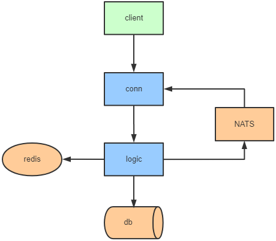

# zim

## Architecture

## Protocol

| Name          | Length        |  Remark                 |
|:--------------|:--------------|:------------------------|
| HeaderLen     | 4 bytes       | header length           |
| Version       | 4 bytes       | protocol version        |
| Cmd           | 4 bytes       | command for request     |
| Seq           | 4 bytes       | sequence id             |
| BodyLen       | 4 bytes       | body length             |
| Body          | BodyLen bytes | protobuf binary bytes   |
